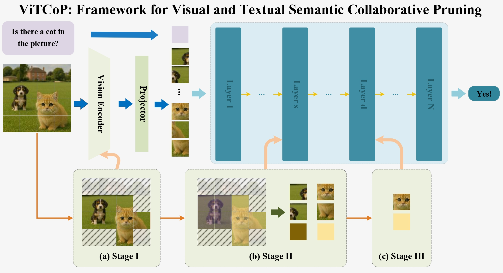
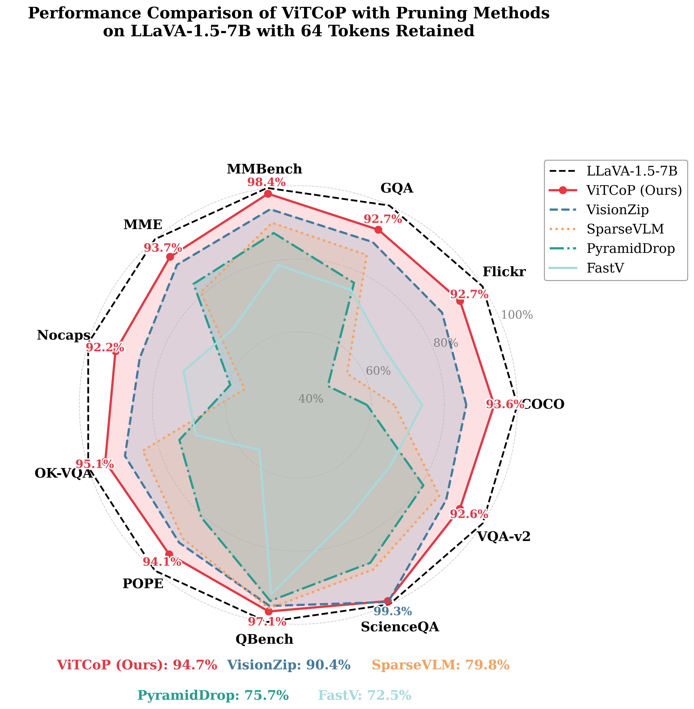

<h1 style="text-align:center">🔥 ViTCoP: Accelerating Large Vision-Language Models via Visual and Textual
Semantic Collaborative Pruning</h1>

<p align="center">
  <b>ViTCoP has been accepted to <a href="https://aaai.org/aaai-conference/">AAAI 2026</a>! 🎉</b><br>
</p>

<p align="center">
  
  
  
  
</p>

# Abstract
Large Vision-Language Models (LVLMs) incur high computational costs due to significant redundancy in their visual tokens. To effectively reduce this cost, researchers have proposed various visual token pruning methods. However, existing methods are generally limited, either losing criticalvisual information prematurely due to pruning in the vision encoder, or leading to information redundancy among the selected tokens due to pruning in the Large Language Models
(LLMs). To address these challenges, we propose a Visual and Textual Semantic Collaborative Pruning framework (ViTCoP) that combines redundancy filtering in the vision encoder with step-wise co-pruning within the LLM based on its hierarchical characteristics, to efficiently preserve critical and informationally diverse visual tokens. Meanwhile, to ensure compatibility with acceleration techniques like FlashAttention, we introduce the L2 norm of K-vectors as the token saliency metric in the LLM. Extensive experiments on various Large Vision-Language Models demonstrate that ViTCoP not only achieves state-of-the-art performance surpassing existing methods on both image and video understanding tasks,but also significantly reduces model inference latency and GPU memory consumption.



# Installation
```bash
conda create -n vitcop python=3.10 -y
conda activate vitcop
conda install pytorch==2.1.2 torchvision==0.16.2 torchaudio==2.1.2 pytorch-cuda=11.8 -c pytorch -c nvidia

cd lmms-eval
pip install -e .
cd ..

cd LLaVA
pip install -e .
cd ..
```

# Results


## LLaVA-1.5-7B
To get the LLaVA-1.5-7B results from the paper, you can follow the instructions below to run the code.
```bash
bash eval/llava/vitcop_llava_1_5.sh
```

## Efficiency
```bash
bash eval/vitcop_efficiency.sh
```

# References
The code is implemented based on [lmms-eval](https://github.com/EvolvingLMMs-Lab/lmms-eval), [LLaVA](https://github.com/haotian-liu/LLaVA), [SparseVLM](https://github.com/Gumpest/SparseVLMs) and [VisionZip](https://github.com/dvlab-research/VisionZip). We thanks the contributors for their great work!

# Citation
> TODO

